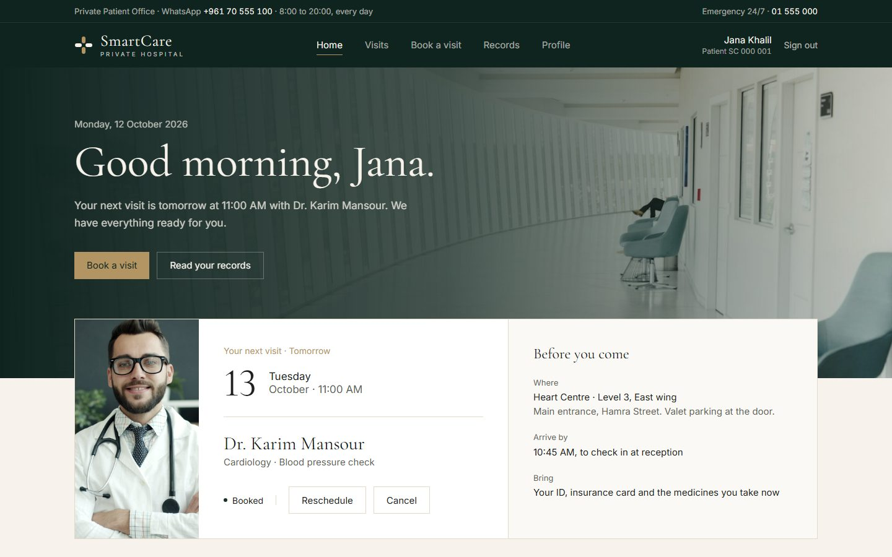
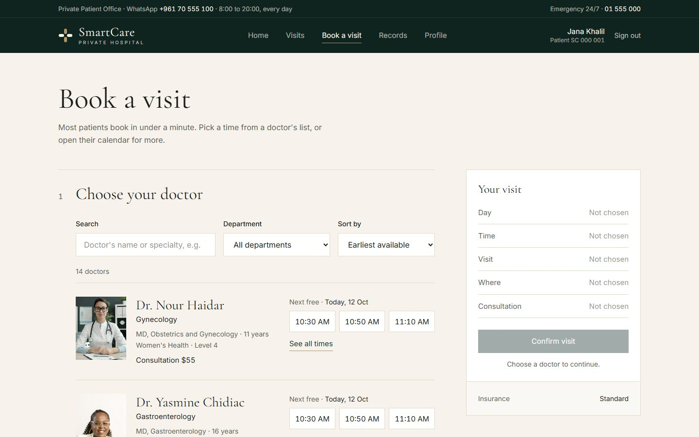
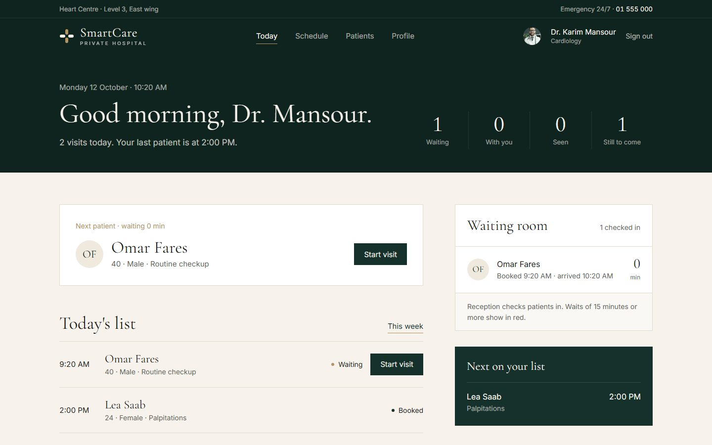
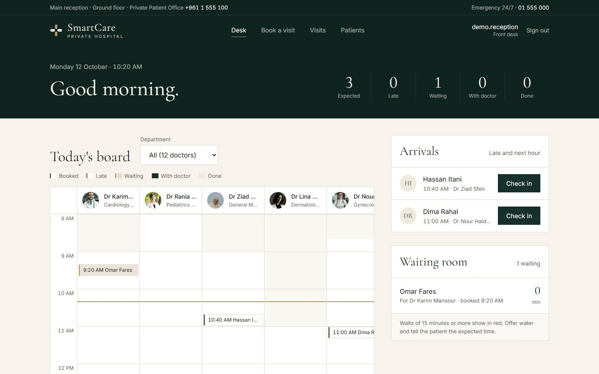
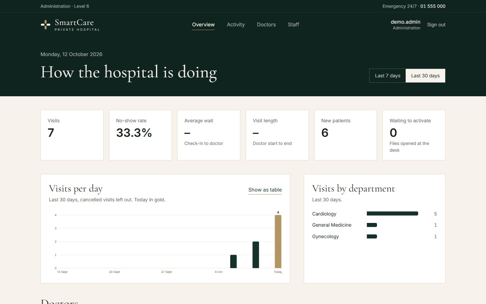
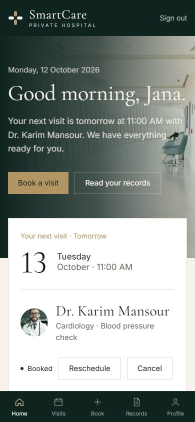

# SmartCare

[](https://github.com/MayaChaker/SmartCare-HMS/actions/workflows/ci.yml)

**Live demo:** https://smart-care-hms.vercel.app/

SmartCare is a full-stack hospital management system for a private hospital. It has a public website and four portals, one for each role: patients, doctors, the front desk and the administration. Each person only sees the tools their role needs, and the server enforces the same rules.

The project follows how a real visit works: a patient books a time inside the doctor's working hours, the front desk checks them in, the doctor starts and completes the visit and writes the note, and the administration follows the numbers.

> The backend runs on a free hosting tier, so the first request after a period of inactivity can take up to a minute while the server wakes up.


## Try the Demo

Open the [login page](https://smart-care-hms.vercel.app/login) and click a role under **Try the demo as**, or sign in with:

| Role | Username | Password |
| --- | --- | --- |
| Patient | `demo.patient` | `SmartCareDemo` |
| Doctor | `dr.karim.mansour` | `SmartCareDemo` |
| Front desk | `demo.reception` | `SmartCareDemo` |
| Administration | `demo.admin` | `SmartCareDemo` |

Demo accounts can use every main flow: booking, moving and cancelling visits, check-in, starting and completing visits, and writing visit notes. Changing accounts, profiles, portraits and working hours is turned off for them. The demo data is reset every night.

## Screenshots

| Patient: home | Patient: book a visit |
| --- | --- |
|  |  |

| Doctor: today | Front desk: today's board |
| --- | --- |
|  |  |

| Administration: overview | Patient portal on a phone |
| --- | --- |
|  |  |

## My Role

<!-- Describe what you designed and built, the decisions you made, and what you learned. -->

## Features

**Public website**
- Centers, doctors, the patient experience and facilities, with a way into the patient portal

**Patients**
- Book a visit in under a minute: filter doctors by department, see each doctor's next free times and consultation fee, then pick a visit type
- Move or cancel a visit, and see past and upcoming visits
- Read visit notes and prescriptions written by the doctor
- Keep their own file up to date (contact details, allergies, blood type, insurance)
- Activate an account with the one-time code the front desk gives them, or register online

**Doctors**
- Today's list, the waiting room with waiting minutes, and the next patient
- Start and complete a visit, and write the note: symptoms, examination, diagnosis, treatment, prescriptions and follow-up date
- A weekly schedule, a patient list with each patient's chart, and the profile patients see (portrait, hours, taking bookings or not)

**Front desk**
- Today's board with every working doctor as a column, late arrivals, and the waiting room
- Check patients in, mark no-shows, and book, move or cancel visits for them
- Open a new patient file with only a name, mobile and date of birth; the patient gets an activation code and completes the rest themselves

**Administration**
- Overview for the last 7 or 30 days: visits, no-show rate, average wait, visit length, new patients, visits per day and per department, and a table per doctor
- Activity log: who did what and when (bookings, check-ins, notes, account changes)
- Add and edit doctors: portrait, department, qualification, fee and booking hours
- Staff accounts with a temporary password that must be changed at first sign-in, and password resets

## Rules the Server Enforces

- Visits can only be booked in the future, inside the doctor's working hours, and never on a time that is already taken by the doctor or by the same patient
- A visit only moves forward, and each step belongs to one role:

  | From | To | Who |
  | --- | --- | --- |
  | `scheduled` | `checked-in`, `no-show` | front desk |
  | `scheduled` | `cancelled` | front desk or patient |
  | `checked-in` | `in-progress` | doctor |
  | `checked-in` | `cancelled` | front desk |
  | `in-progress` | `completed` | doctor |

  Completed, cancelled and no-show visits are final. A no-show can only be marked after the visit's time.
- A visit note belongs to one visit, and only that visit's doctor can write it once the visit has started
- Dates and "today" follow the hospital's time zone (Beirut), not the server's clock

## Security

- Every API route checks the token and the user's role on the server; hiding a button in the UI is never the only protection
- Each request reloads the user, so deleted accounts and role changes take effect immediately
- Patients can only reach their own data, and doctors only patients they have an appointment with
- Passwords are hashed with bcrypt. Staff accounts start with a temporary password, and the server refuses every other request until it is changed
- Activation codes are stored as hashes and expire after 14 days
- Sign-in, registration, activation and password changes are rate-limited
- Portraits must be JPG, PNG or WebP up to 3 MB, and the file's first bytes must match its type. They are stored in the database, because the hosting disk is wiped on every deploy
- No credentials live in the code: the first admin account is created from environment variables

## Tech Stack

- **Frontend:** React 19, Vite, React Router, Tailwind CSS 4
- **Backend:** Node.js 20, Express 5
- **Database:** MySQL with Sequelize
- **Auth:** JSON Web Tokens and bcrypt-hashed passwords
- **Uploads:** Multer, kept in memory and checked before saving
- **Tests and CI:** Node's test runner against a real MySQL database, GitHub Actions
- **Hosting:** Vercel (frontend), Render (backend), TiDB Cloud (MySQL)

## Getting Started

### Requirements

- Node.js 20
- npm
- MySQL 8 running locally

### 1. Database

Create an empty database (MySQL Workbench, or the `mysql` command line):

```sql
CREATE DATABASE smartcare_db;
```

The tables are created automatically the first time the backend starts.

### 2. Backend

```bash
cd backend
npm install
```

Create `backend/.env` from the example file:

| OS | Command |
| --- | --- |
| macOS / Linux | `cp .env.example .env` |
| Windows (PowerShell) | `Copy-Item .env.example .env` |
| Windows (Command Prompt) | `copy .env.example .env` |

Then open `backend/.env` and set at least:

```env
JWT_SECRET=<long random string>
ADMIN_USERNAME=<your admin username>
ADMIN_PASSWORD=<8+ characters>
DB_USER=root
DB_PASSWORD=<your MySQL password>
```

To generate a `JWT_SECRET`:

```bash
node -e "console.log(require('crypto').randomBytes(48).toString('hex'))"
```

Start the API (it restarts when you edit a file):

```bash
npm run dev
```

The API runs at http://localhost:5000. On the first start it creates the admin account from `ADMIN_USERNAME` and `ADMIN_PASSWORD`.

### 3. Frontend

In a second terminal:

```bash
cd frontend
npm install
npm run dev
```

The app runs at http://localhost:5173. In development, Vite forwards `/api` to the backend, so no frontend configuration is needed.

### 4. Sample data (optional)

**Option A: the full demo.** Set `DEMO_PASSWORD=<8+ characters>` in `backend/.env` and restart the API. On its first start it creates the four demo accounts, 14 sample doctors, a few patients and visits around today.

**Option B: sample doctors only.**

| OS | Command (in `backend`) |
| --- | --- |
| macOS / Linux | `SEED_DOCTOR_PASSWORD=<8+ characters> npm run seed` |
| Windows (PowerShell) | `$env:SEED_DOCTOR_PASSWORD="<8+ characters>"; npm run seed` |

All sample doctors share that password; their usernames are printed by the script (for example `dr.karim.mansour`). Running it again skips accounts that already exist.

### 5. Try it

1. Sign in with your admin account and add a front desk account under **Staff**. Note the temporary password it shows.
2. Sign in as the front desk (you will be asked to choose a new password), open a patient file and book a visit.
3. Use the activation code at http://localhost:5173/activate to create the patient's sign-in.
4. Check the patient in at the front desk, then sign in as the doctor to start the visit, write the note and complete it.

## Tests

The backend has 88 tests built on Node's test runner. They cover sign-in and password changes, role checks, data ownership (IDOR), booking rules, the visit status flow, the front desk and activation codes, the administration, upload checks and the demo restrictions. They run against a real MySQL database named `smartcare_test`, which is created automatically and wiped on every run. The tests refuse to start against any database whose name does not end with `_test`.

```bash
cd backend
npm test
```

They use the `DB_USER`, `DB_PASSWORD` and `DB_HOST` values from `backend/.env`.

[GitHub Actions](.github/workflows/ci.yml) runs these tests, plus the frontend lint and build, on every push to `main` and on every pull request. The `main` branch only accepts changes through pull requests that pass both checks.

## Environment Variables

**Backend** (`backend/.env`, see [backend/.env.example](backend/.env.example))

| Variable | Required | Description |
| --- | --- | --- |
| `JWT_SECRET` | yes | Secret used to sign login tokens; the server will not start without it |
| `ADMIN_USERNAME`, `ADMIN_PASSWORD` | first run | First admin account, created only if it does not exist |
| `DATABASE_URL` | one of | Full MySQL connection URL for a hosted database (SSL enabled) |
| `DB_NAME`, `DB_USER`, `DB_PASSWORD`, `DB_HOST`, `DB_PORT` | one of | Local MySQL connection settings |
| `CORS_ORIGINS` | production | Comma-separated frontend URLs allowed to call the API |
| `NODE_ENV` | production | Set to `production` when deployed |
| `DEMO_PASSWORD` | no | Enables the public demo accounts and sets their password (8+ characters) |
| `DEMO_RESET_TOKEN` | no | Secret required by `POST /api/demo/reset` |
| `CLINIC_TIME_ZONE` | no | The hospital's time zone, default `Asia/Beirut` |
| `PORT` | no | API port, default `5000` |

**Frontend** (`frontend/.env`, see [frontend/.env.example](frontend/.env.example))

| Variable | Description |
| --- | --- |
| `VITE_API_BASE_URL` | Backend URL ending in `/api`; only needed for production builds |
| `VITE_DEMO_PASSWORD` | Shows the demo sign-in buttons on the login page; must match the backend's `DEMO_PASSWORD` |

## Deployment

- **Frontend (Vercel):** root directory `frontend`, set `VITE_API_BASE_URL=https://<backend-host>/api`. `vercel.json` sends every route to `index.html`, so refreshing `/dashboard` works.
- **Backend (Render or similar):** root directory `backend`, start command `npm start`, and set `NODE_ENV=production`, `JWT_SECRET`, `ADMIN_USERNAME`, `ADMIN_PASSWORD`, `DATABASE_URL` and `CORS_ORIGINS=https://<frontend-host>`. On startup the server adds any new columns to an existing database before it serves requests.
- **Public demo (optional):** set `DEMO_PASSWORD` and `DEMO_RESET_TOKEN` on the backend and `VITE_DEMO_PASSWORD` on the frontend. The first start creates the demo data. The [Reset demo data](.github/workflows/demo-reset.yml) workflow restores it every night and can also be run by hand from the Actions tab; it needs the same token as a `DEMO_RESET_TOKEN` repository secret on GitHub.
- **Database:** any hosted MySQL-compatible service that provides a connection URL.

## API Overview

All routes are under `/api`. Apart from the public routes, every route needs an `Authorization: Bearer <token>` header and the listed role.

| Area | Method and path | Role |
| --- | --- | --- |
| Auth | `POST /auth/login`, `POST /auth/register-patient`, `POST /auth/activate` | public |
| | `POST /auth/change-password` | signed in |
| Doctors | `GET /doctors`, `GET /doctors/:id/photo` | public |
| Health | `GET /health` (checks the database too; 503 when it is down) | public |
| Demo | `POST /demo/reset` (header `X-Demo-Reset-Token`) | reset token |
| Patient | `GET`, `PUT /patient/profile` | patient |
| | `GET`, `POST /patient/appointments` | patient |
| | `PUT /patient/appointments/:id` (move), `DELETE /patient/appointments/:id` (cancel) | patient |
| | `GET /patient/records`, `GET /patient/doctors` | patient |
| | `GET /patient/availability?days=` (free times per doctor) | patient |
| Doctor | `GET`, `PUT /doctor/profile`, `POST /doctor/photo`, `PUT /doctor/availability` | doctor |
| | `GET /doctor/appointments`, `GET /doctor/schedule`, `PUT /doctor/appointments/:id` | doctor |
| | `GET /doctor/patients`, `GET /doctor/patients/:id` | doctor |
| | `POST /doctor/records`, `PUT /doctor/records/:id` | doctor |
| Front desk | `GET`, `POST /receptionist/patients`, `PUT /receptionist/patients/:id` | receptionist |
| | `POST /receptionist/patients/:id/activation-code` | receptionist |
| | `GET /receptionist/doctors`, `GET /receptionist/availability?days=` | receptionist |
| | `GET`, `POST /receptionist/appointments`, `GET /receptionist/appointments/day?date=` | receptionist |
| | `PUT /receptionist/appointments/:id`, `PUT /receptionist/checkin/:appointmentId` | receptionist |
| Administration | `GET`, `POST /admin/users`, `PUT`, `DELETE /admin/users/:id` | admin |
| | `POST /admin/users/:id/reset-password` | admin |
| | `GET /admin/doctors`, `PUT /admin/doctors/:id`, `POST /admin/doctors/:id/photo` | admin |
| | `GET /admin/analytics?days=7\|30`, `GET /admin/activity` | admin |
| | `GET /admin/patients`, `GET /admin/appointments` | admin |

Example:

```bash
curl -X POST http://localhost:5000/api/auth/login \
  -H "Content-Type: application/json" \
  -d '{"username":"<username>","password":"<password>"}'
```

## Project Structure

```text
SmartCare-HMS/
  backend/
    config/        database, demo and auth settings
    controllers/   request handlers per role
    middlewares/   token, role and demo checks
    models/        Sequelize models
    routes/        Express routers per role
    utils/         booking, status, time zone, activation, audit and upload rules
    demo/          sample data and the demo reset
    scripts/       seed script
    tests/         API and rule tests
    app.js         Express app: middleware and routes
    server.js      database connection, startup tasks, listen
  frontend/
    src/
      pages/       one page per portal, plus home, sign-in, activation and password change
      components/
        site/      the public website
        auth/      sign-in and registration layout
        portal/    shared portal layout and one folder per role
      hooks/       data loading and actions for each portal
      content/     texts for the website and portals
      context/     signed-in user
      styles/      Tailwind theme
      utils/       API client and scheduling helpers
```
